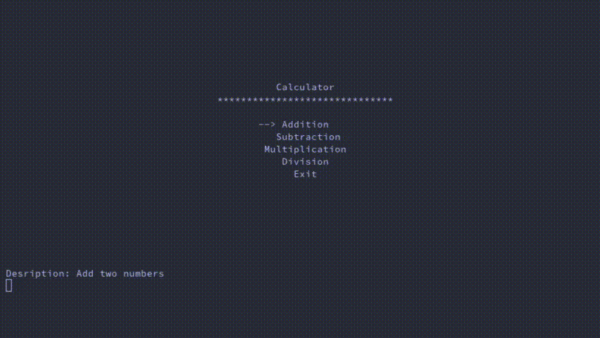

# MenuMaker

Menumaker is a library that can be used to create menus for programs. It has an easy to use way of adding entries for menu items and displaying them on the terminal.  
*This library is currently only supported on Linux*

## Features
- Easy to use method along with wizard.
- Use of arrow keys for navigation and enter for selection.
- Centered menu listing
- Terminal resize support
- Highlighted menu entries.
- Dynamically updated description for highlighted option
- Optional return value or default values assignment.

## Example Screenshots
  


## Method
- Place the files ```mmaker.h``` and ```func.h``` from the ```src``` directory into your working directory.  
- Include the header file "mmaker.h"  
        ```#include "mmaker.h"```  
- Make an object of class menu where the menu has to be created.   
        Example: ```menu obj;```  
- The name of the menu can be added by the `menu_head(string)` method.  
        Example: ```obj.menu_head("Menu Name");```  
- Add entries to the menu class using the function `add(string, int, string)`. The default values for return value is assigned serial wise and the default description is NULL.  
        Example: ```obj.add("Entry Name", return_value, "Description");```  
- The return value and description are optional. Entries can also be added as:   
        ```obj.add("Entry Name", return_value);``` or ```obj.add("Entry Name");```  
- After adding all the menu entries call the function display, which returns an integer value corresponding to the menu entry number which can then be used to call the appropriate function.  
        Example: ```int x = obj.display();```  
